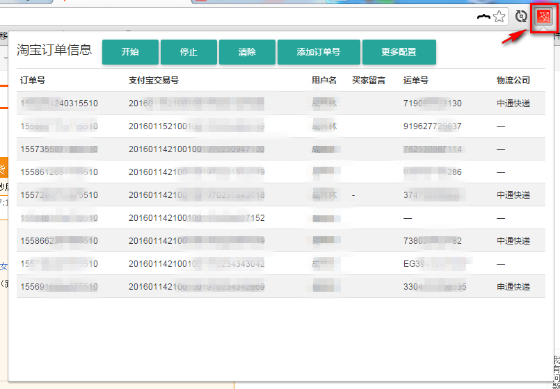
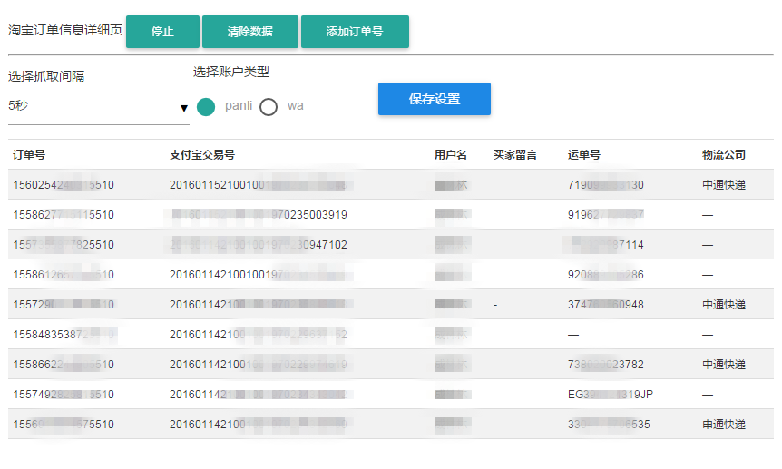

## 订单信息抓取工具  chrome扩展

>v0.0.1

凡是基于 chrome 内核的 浏览器 都可以使用本 扩展: 例如市面上 常见的  qq浏览器 、百度浏览器 、360浏览器 、猎豹浏览器等等

## 安装说明

- 安装 基于 chrome 内核的浏览器 (最好谷歌浏览器，一下操作全部基于 谷歌浏览器)

- 打开浏览器在 **地址栏 ** 输入 `chrome://extensions/`

- 把得到的 **PanCrawl.crx** 文件拖拽到 浏览器里 稍等几秒既可以安装

---

## 使用说明

>等待添加

---

## 视频手动输入订单号

<video id="video" controls="" preload="none" poster="http://media.w3.org/2010/05/sintel/poster.png">
      <source id="mp4" src="http://media.w3.org/2010/05/sintel/trailer.mp4" type="video/mp4">
      <source id="webm" src="http://media.w3.org/2010/05/sintel/trailer.webm" type="video/webm">
      <source id="ogv" src="http://media.w3.org/2010/05/sintel/trailer.ogv" type="video/ogg">
</video>

## 界面视觉友好 view show

>订单详细页操作按钮

---

>扩展后台界面 (展现数据更多，视野宽阔)

