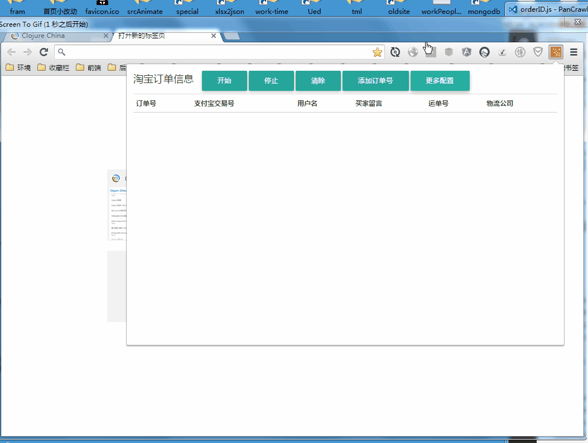
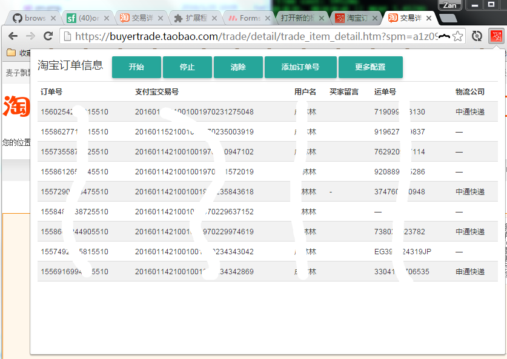
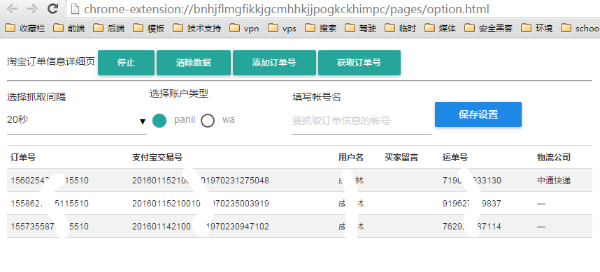
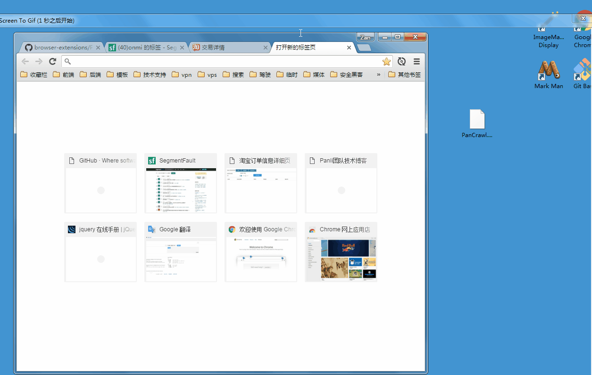
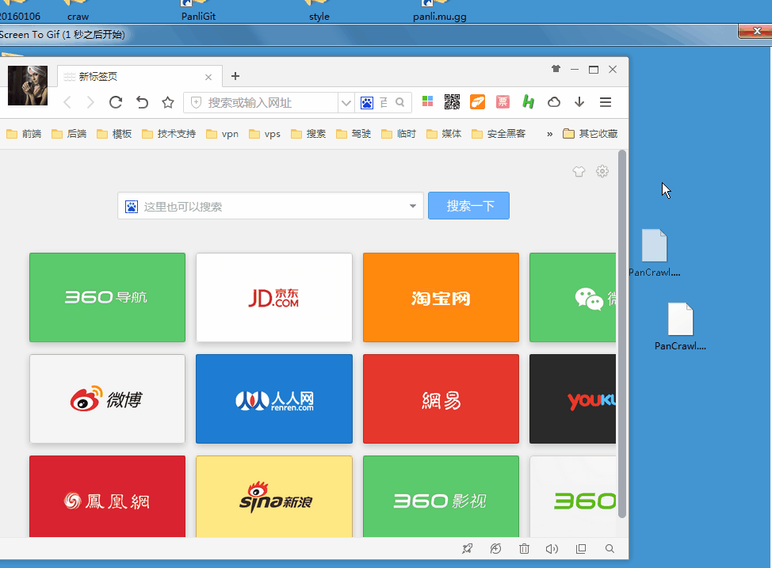
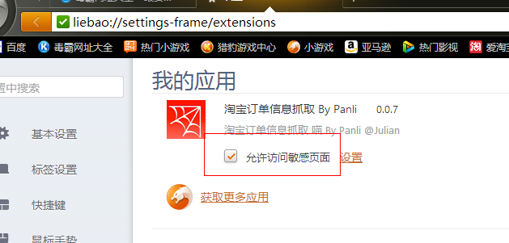

## 订单信息抓取工具  chrome扩展

#### License

MIT @Julian (zanjser@163.com)

>v0.2.3
  - 淘宝 url 新增，页面结构渲染新增 React 渲染模式
    - url 新增 `trade.taobao.com/trade/detail/trade_order_detail.htm`
    - 由于淘宝页面渲染 采用 2 种不同的渲染模式，所有根据淘宝的渲染模板 匹配 不同的抓取信息方案

> v0.2.2
  - 天猫订单信息通信报错
    - 天猫页面文本里存有 `script` 标签 ，导致通信被中断
    - 过滤掉内容信息的 `script` 标签

---

> v0.2.1
  - 天猫错误页面
    - 在访问天猫页面是偶尔会出现 天猫抛出的错误页面
    - 新增 [天猫错误页面](http://err.tmall.com/error1.html) 的监听处理

> v0.1.9
  - 用户名错误
    - 天猫页面模板渲染会随机选择一类模板，出现大量换行和空字符，导致用户名匹配错误
  - 新增更新提醒
    - 如果发布了新版，会在打开后台时弹出提醒

---

> v0.1.8

- 页面无响应
 - 修复 网络加载js 错误

> v0.1.7 

- 无权访问此页面死循环
 - 抓取账号中存在不是自己的订单号,则跳过该订单,并给予提示抓取识别订单号

>v0.1.6

- 天猫订单抓取 改为 正则匹配

>v0.1.5

 - 订单号获取接口数据筛选
  - 订单号出现 不是16位过滤掉

>v0.1.3

- 天猫的页面数据结构 又改变了（reactjs 渲染取消了）
  - 修复抓取信息的结构算法
  
- 修复 在网络错误的情况下,该网络错误的订单 未抓取到信息
  - 网络错误的订单重载抓取

- 调节抓取的信息的时间点, 
  - 由原来的 页面加载完成就抓取 改为 页面加载完成后, 等待抓取时间间隔后再抓取页面信息
  
- 默认的抓取时间间隔 改为 `7秒`

- 获取订单号接口的数据里面 ,会出现 一条数据里面存着多个订单号
  - 重新查封符合条件的订单号

[阿里云下载地址]()

>v0.1.2

修复在 浏览器页面渲染慢的情况, 数据渲染太慢导致无法捕捉到信息

v0.1.1

修复 订单抓取失败 的 展现

增加 网络错误的 统计

增加更多时间选择

>v0.1.0

天猫页面 react 重构

导致分解信息失败

>v0.0.8

优化加载引擎,执行效率更高

>v0.0.7

修复页面出现 `客官，现在网络繁忙，请稍候再试 ` 后无法继续执行脚本

- 新增需要注入脚本的页面 `https://tradearchive.taobao.com/trade/detail/trade_item_detail.htm?biz_order_id=0`

>v0.0.6

- 凡是有支付宝交易号的 ，都提交到后台
- 目前好像每个订单都会有支付宝交易号,因此失败订单号常规下 不会出现

>v0.0.5

- 运单号 和 物流公司的值 如果为 "—" 则转为 ""

>v0.0.4

- 修复 天猫 页面订单号抓取错误, 改为url 参数 获取
- 新增进度显示
- 新增抓去失败订单号
- 新增最后一次通信时间
- 新增 **trade.tmall.hk** 域名下的抓取

?如果淘宝页面提示 保存数据出错,

>v0.0.3

数据存储重构

修复 订单 id 数量大的情况下 保存不了

>v0.0.2

凡是基于 chrome 内核的 浏览器 都可以使用本 扩展: 例如市面上 常见的  qq浏览器 、百度浏览器 、360浏览器 、猎豹浏览器等等

---

## 远程获取订单号

> 在文本框内输入 `帐号` , `订单号获取地址` ,和 `订单号信息提交保存地址` ，选择合适的 `抓取间隔时间`,
> (不建议设置5秒，容易出现机器验证码,时间间隔越长，越安全)
> 输入完信息后 点击保存设置 ，然后 点击 `获取订单号` 开始抓取

- ? 如果提示没有订单，请确定输入的帐号是否正确或者输入帐号 要抓去的订单为空了
- ? 订单号获取地址 和 提交订单地址 请 @管总
- ? 如果还有其他问题,请在下方留言

---

## 手动输入订单号

> 详细请见压缩包内的 help 文件夹下的 视频 文件

## 界面视觉友好 view show

>订单详细页操作按钮

---

>扩展后台界面 (展现数据更多，视野宽阔)

## 一台电脑同时抓取多个帐号

> 操作很简单 您只需要安装多个 浏览器即可

> 每个浏览器配置好 扩展、 启动抓取脚本,

> 就可以安心的把浏览器最小化，接着配置下一个浏览器抓取帐号,然后以此类推

> 如果您电脑安装了 谷歌浏览器 、360极速浏览器 、百度浏览器 、qq浏览器 、猎豹浏览器，

> 那么就可以同时抓取 5个帐号的订单了

## 谷歌浏览器安装说明

- 安装 基于 chrome 内核的浏览器 (最好谷歌浏览器，一上演示操作全部基于 谷歌浏览器)

- 打开浏览器在 **地址栏 ** 输入 `chrome://extensions/`

- 把得到的 **PanCrawl.crx** 文件拖拽到 浏览器里 稍等几秒既可以安装

## 360极速浏览器安装

> 找到浏览器的扩展程序页面 拖拽进去安装

## 猎豹浏览器安装

> 点击左上角大豹子头像,鼠标滑到 ->工具 -> 我的应用 拖拽进去安装
> 或者浏览器地址 输入 `liebao://settings-frame/extensions` 进入我的应用 把插件拖拽进去安装

记住一定要把 **允许访问敏感页面** 勾上 否则无法执行脚本 

勾选后记得重启下

